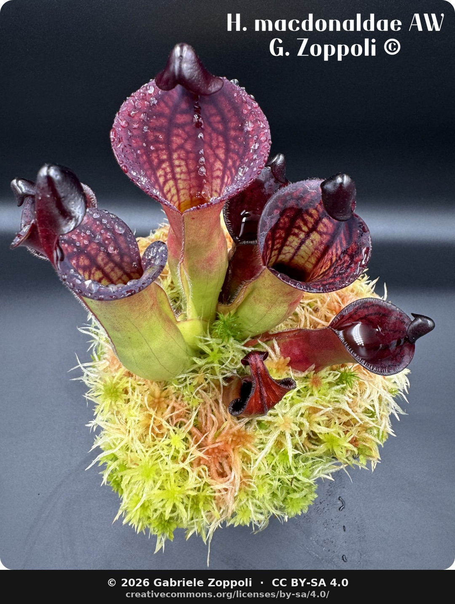

This is the first post on the blog tab. It exists mostly to unlock the pattern — once one post is published, the listing page and the RSS feed spring to life, and the next post costs me a few minutes of markdown.

## What shows up here

Short notes, mostly. Three rough categories:

- **Build logs** — the terrarium hardware keeps evolving (a new sensor, a control loop tuned, a pump replaced). Worth recording the small changes, because after five failures I forget which.
- **Species observations** — when a specific plant does something worth writing about: an *H. macdonaldae* that decides, after three years of refusing, to flower on a Tuesday in August; a *D. cuthbertsonii* that turns pink in November; roots changing colour from `doro-ne` to `rubii-ne` on an *Akausagi*.
- **The odd essay** — where the day job and the plants overlap. Oncology has taught me a lot about how to keep delicate living things alive in hostile environments; the plants, in return, have taught me patience at the bedside. Both deserve writing about.

## Photos in posts

Posts live as **page bundles** — a folder with an `index.md` and any photos dropped in alongside. You reference them with plain markdown, no paths, no fiddling:

```markdown

```

Hugo resolves the relative path automatically and bakes the image into the post. Multiple photos per post are fine. For a gallery with captions, use the `figure` shortcode (documented below).

## A first photo

Here is the *Heliamphora macdonaldae* from Cerro Duida that already anchors the homepage — three years in cultivation, finally comfortable in the cabinet.



## Cadence

No promises on frequency. A post when there's something honest to say.
